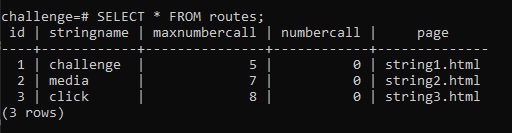
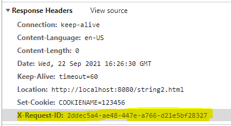
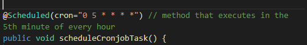
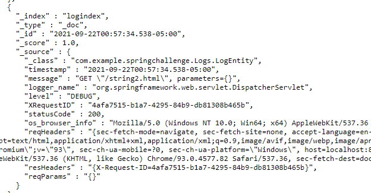

# Spring Boot Application
This repo contains a spring-boot application that includes the requirements specified in the back-end developer test. 

## Installation 
It is necessary to have docker and docker-compose already set-up
- The ./data folder will contain the volumes for the database and elasticsearch intance
- ./springchallenge contains the code of the spring application
- ./sql contain the queries to initialize the database. They load up when running it with docker-compose 

```bash
  git clone https://github.com/Lu1sR/springBootApp.git
  cd springBootApp/
```
To boot-up everything(spring-app, postgres db and elasticseatch instance) you just need docker-compose
```bash
  docker-compose up
```
*Give it a few seconds after the docker-compose command finishes, sometimes the elasticsearch instance takes a little bit longer to boot-up and that can show errors on the console. Afte a couple seconds the spring-app should automatically restart and start working properly*

- Check the localhost:8080 for the spring application 
- check the elasticsearch instance on localhost:9200

## Features
The database should look like this:



#### Check the strings in the database

```http
  GET /api/v1/challenge/${string-value}
```

| Parameter | Type     | Description                |
| :-------- | :------- | :------------------------- |
| `string-value` | `string` | **Required**. string name as in the database |
After 

### Http requests
All the http requests will be logged in the click.json file inside the springchallenge directory. The MDC filter will write a new header **X-Request-ID** to improve the traceability of the requests.

 

### Cronjob
The 5th minute of each hour a scheduled task runs in the background to save the logs in the elasticsearch instance 

 


 ### Elasticsearach
 The spring application creates a new index called **logindex** in which all the logs are saved. 

To check the index information 
```http
  GET /logindex
```

To check a sample of the logs saved in the elasticsearch instance
```http
  GET /logindex/_search
``` 

To check a more logs...
```http
  GET /logindex/_search?pretty=true&q=*:*&size=50
``` 
 

